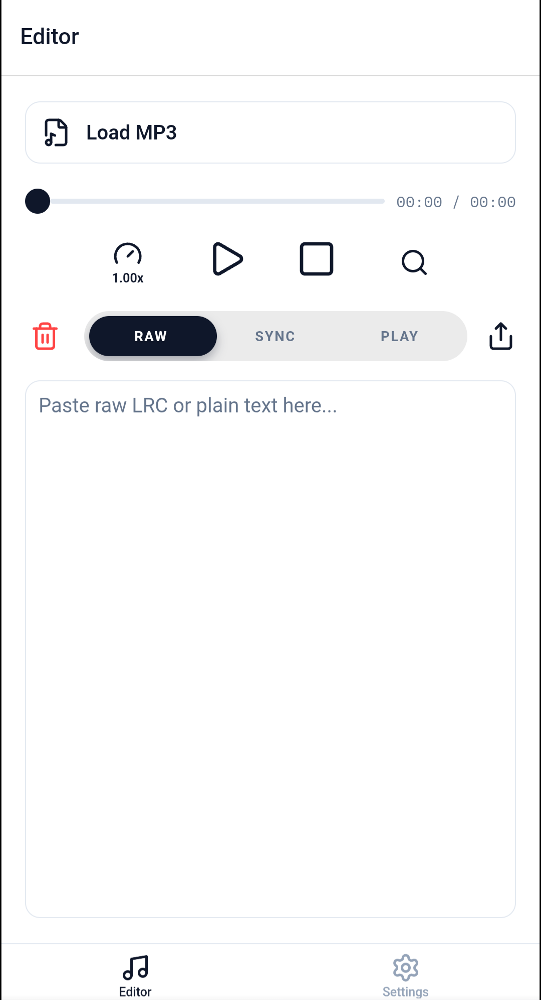
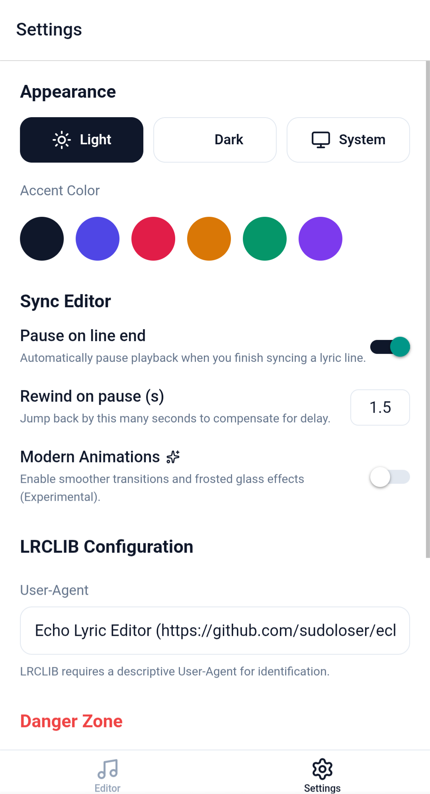

# Echo - Minimalist Lyric Editor

Echo is a minimalist, open-source lyric editor built with Expo and TypeScript, designed specifically for syncing and publishing lyrics to [LRCLIB](https://lrclib.net/).

## Features
- **Minimalist UI**: Focused on the core task of lyric editing and syncing.
- **Sync Editor**: Easy-to-use interface for adding timestamps to plain text lyrics.
- **Real-time Player**: Preview your synced lyrics with the built-in audio player.
- **Instant Upload**: Submit your lyrics to LRCLIB via the integrated [LRCLIB UP](https://lrclibup.boidu.dev/) interface.
- **Export to .lrc**: Save your work locally as standard LRC files.
- **Cross-Platform**: Works as an Android APK and a static Web site (PWA supported).

## Screenshots
<p align="center">
  
  
</p>

## Setup

1. **Clone the repository**:
   ```bash
   git clone https://github.com/explysm/echo.git
   cd echo
   ```

2. **Install dependencies**:
   ```bash
   pnpm install
   ```

3. **Start the development server**:
   ```bash
   npx expo start
   ```

## Building & Releasing

### Android APK
The project includes a GitHub Workflow for building the release APK. To use it:
1. Set up the following secrets in your GitHub repository:
   - `KEYSTORE`: Base64 encoded keystore file.
   - `KEYSTORE_PASS`: Password for the keystore.
   - `KEY_ALIAS`: Alias for the key.
   - `KEY_PASS`: Password for the key.
2. Push a tag starting with `v` (e.g., `v1.1.0`) to trigger the build and release.

### GitHub Pages (Web)
The web version is automatically deployed to GitHub Pages whenever you push to the `main` branch.

## Contributing
Contributions are welcome! Please feel free to submit a Pull Request or open an issue.

## License
This project is licensed under the MIT License - see the [LICENSE](LICENSE) file for details.
